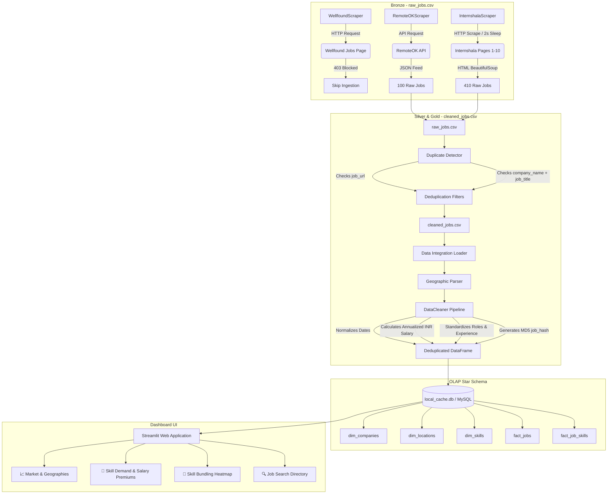

# 💼 Placement Market Intelligence Platform

A production-ready Data Engineering & Analytics portfolio platform designed to analyze job postings across multiple portals, identifying skill demand share, company hiring velocity, salary premiums, and location clusters.

This platform showcases modular Python ETL design, dual SQLite/MySQL schema compatibility, custom web scraping, and NLP-based tech-skill extraction, exposing visual insights through an interactive Streamlit application.

---
## Key Project Metrics

- 491 Real Job Postings Analyzed
- 361 Hiring Companies
- 158 Geographic Locations
- 27 Skills Catalogued
- 364 Job-Skill Relationships
- ₹784,621 Average Annual Salary
- 24.64% Fresher Accessibility Ratio


---
## 🏗️ System Architecture

The platform separates ingestion bottlenecks from analytical transformations by utilizing a multi-layered data architecture (Bronze -> Silver -> Gold):



---

## ⚡ Business Problem & Solution Approach

### The Business Problem
For freshers and placement cells, navigating the job market is highly fragmented. Portals describe requirements in unstructured textual blocks, salaries are listed in multiple currencies or frequencies (monthly/hourly), and duplicate postings spam listings. There is a lack of structured analytics showing the true **skill demand share**, **salary premium index**, and **geographical tier trends**.

### The Solution
We built an automated data ingestion pipeline that extracts raw job metadata, normalizes currencies and frequencies into standardized annual INR values, deduplicates items across systems, extracts software skills via precompiled regular expressions, structures them into an OLAP database, and exposes insights through a Streamlit dashboard.

---
## Business Impact

This platform transforms fragmented job listings into actionable career intelligence for students, placement cells, and job seekers.

### Key Outcomes

- Consolidated 491 real job postings from multiple sources into a centralized analytics platform.
- Analyzed hiring activity across 361 companies and 158 geographic locations.
- Measured skill demand trends to identify the most frequently requested technologies and tools.
- Calculated salary benchmarks and premium skills using standardized annual compensation estimates.
- Identified fresher-friendly opportunities through the Fresher Accessibility Ratio (FAR).
- Reduced manual job-market research by providing a single dashboard for hiring trends, location analysis, skill demand, and salary insights.

### Business Value

The platform enables data-driven career planning by helping users:

- Prioritize high-demand skills.
- Target companies actively hiring.
- Compare opportunities across locations.
- Understand salary expectations.
- Make informed placement and upskilling decisions.

---


## 🛠️ Tech Stack

| Technology | Purpose | Description |
| :--- | :--- | :--- |
| **Python** | Core Programming | Drives scrapers, ETL parsing, and data orchestration. |
| **SQLite / MySQL** | Database Engine | Dual-compatibility relational storage optimized for OLTP core and OLAP view mapping. |
| **Streamlit** | Presentation Layer | Exposes interactive KPIs, filters, and graphs. |
| **Pandas** | Data Wrangling | Executes batch cleanups, scaling calculations, and aggregations. |
| **BeautifulSoup** | Web Scraping | Parses server-side HTML trees for Internshala job cards. |
| **Requests** | HTTP client | Queries RemoteOK's JSON API and scrapes pages. |
| **SQL** | Analytical Queries | Calculates complex metrics like Salary Premiums and skill relationships. |

---

## 📂 Project Structure

```text
placement-market-intelligence/
├── README.md                           # Portfolio-grade documentation
├── requirements.txt                    # Project dependencies
├── PROJECT_SUMMARY.md                  # Executive recruiter-friendly summary
├── database/
│   ├── schema_oltp.sql                 # MySQL relational core table creation
│   ├── schema_olap_views.sql           # MySQL reporting view definitions
│   └── queries_analytics.sql           # Pre-built SQL queries answering KPIs
├── src/
│   ├── ingestion/                      # Ingestion Layer
│   │   ├── internshala_scraper.py      # BeautifulSoup-based card extractor
│   │   ├── remoteok_scraper.py         # JSON API ingestion client
│   │   ├── wellfound_scraper.py        # Safe-failing connector (403 bypass)
│   │   └── run_ingestion.py            # Aggregator, duplicate filter, and report CLI
│   ├── pipeline/                       # Transformation Layer
│   │   ├── data_cleaner.py             # Salary scale, date casting, role mapper
│   │   ├── skill_extractor.py          # RegEx/NLP weighted tech skill matcher
│   │   ├── data_loader.py              # relational SQL database loader
│   │   └── load_scraped_data.py        # Integration runner and load reporter
│   ├── utils/
│   │   └── db_connector.py             # SQLAlchemy dynamic engine (MySQL/SQLite fallback)
│   └── web_app/
│       └── app.py                      # Dashboard application in Streamlit
├── tests/
│   └── test_pipeline.py                # End-to-end integration tests
└── data/                               # Local file storage
    ├── 1_raw/
    │   ├── raw_jobs.csv                # Raw consolidated records
    │   ├── cleaned_jobs.csv            # Deduplicated postings
    │   └── ingestion_report.csv        # Run statistics (collected, removed, unique)
    └── 3_database/
        └── local_cache.db              # SQLite zero-setup database file
```

---

## 📊 Database Design (Star Schema)

The database utilizes a relational Star Schema design to optimize analytical lookups:

* **Fact Table (`jobs`)**: Stores metrics like salary bounds, reference IDs, and links to dimensions.
* **Junction Table (`job_skills`)**: Bridge table mapping jobs to skills with importance weights.
* **Dimension Tables**:
  * `companies`: Industry classification and scale metrics.
  * `locations`: Slices regional hubs by tiers (Tier 1/2/3) and tech-hub flags.
  * `skills`: Catalog of technologies (Language, Framework, Database, Cloud, Tool).

```text
  [dim_companies]              [dim_locations]
         |                            |
         +-------------+--------------+
                       |
                       v
                  [fact_jobs] <-----+
                       |            |
                       v            |
              [fact_job_skills] ----+
                       |
                       v
                  [dim_skills]
```

---

## ⚙️ Ingestion & Transformation (ETL) Pipeline

### 1. Ingestion Layer (Bronze)
* **RemoteOK**: Pulls directly from the JSON feed. Converts ISO dates and scales USD yearly numbers.
* **Internshala**: Scrapes up to 10 pages sequentially, parsing HTML job cards. Converts relative date strings (e.g. `2 weeks ago`) to absolute `YYYY-MM-DD` and extracts salary text.
* **Wellfound**: Attempts connection. If blocked (HTTP 403 Forbidden due to Cloudflare protection), it logs the block, skips Wellfound ingestion, and allows the pipeline to continue.

### 2. Duplicate Detection Strategy
Ingested jobs undergo two stages of duplicate filtering:
* **Ingestion Runner**: Identifies duplicates by comparing `job_url` matches and `company_name + job_title` combinations (case-insensitive, whitespace-stripped). This filters items before saving.
* **ETL Cleaning**: Computes an MD5 fingerprint hash on the tuple `(job_title, company_name, date, url)` to enforce deduplication at the database insertion level.

### 3. Transformation Layer (Silver & Gold)
* **Date Normalizer**: Standardizes dates to datetime indices.
* **Salary Standardizer**: Scales monthly, daily, and hourly bounds across different currencies (USD, INR) into a unified Annualized INR value.
* **Role/Exp Classifier**: Employs rule-based regex taxonomies to classify jobs into standard roles (Data Analyst, Software Engineer, ML Engineer, etc.) and experience tiers (Fresher, Senior, Lead, Mid-Level).
* **Skill Matcher**: Uses precompiled word-boundary regular expressions to extract technical skills, assigning a weight score based on frequency and prominence.

---

## 📈 Dashboard Features

The Streamlit web application includes the following tabs:
1. **Market & Geographies**: Visualizes job postings by city tier, company hiring volume, and industry distribution.
2. **Skill Demand & Salary Premiums**: Computes the top demanded skills and displays a scatter plot representing which skills correlate with the highest salaries relative to the average.
3. **Skill Bundling (Co-occurrence)**: Generates a correlation heatmap showing which tools are commonly requested together (e.g., Python and SQL).
4. **Job Search Directory**: Exposes a tabular search grid of active opportunities.

---

## Dashboard Preview

### Overview Dashboard


### Market Analysis


### Skill Analysis


### Hiring Trends


---

## 📊 Analytics Questions Answered & SQL Views

We created OLAP views to support business analytics (defined in `database/schema_olap_views.sql`):
* `dim_companies_view`: Company classifications.
* `dim_locations_view`: Geography details.
* `dim_skills_view`: Skill categorizations.
* `fact_jobs_view`: Standardized salaries and fresher friendly flags.
* `fact_job_skills_view`: Bridge weights.

### Sample Analytical Query: Identifying High-Salary Skill Premium
```sql
SELECT 
    s.skill_name,
    COUNT(js.job_id) as job_count,
    ROUND(AVG(j.salary_avg), 2) as avg_annual_salary_inr
FROM job_skills js
JOIN jobs j ON js.job_id = j.job_id
JOIN skills s ON js.skill_id = s.skill_id
WHERE j.salary_avg IS NOT NULL
GROUP BY s.skill_name
HAVING job_count >= 2
ORDER BY avg_annual_salary_inr DESC
LIMIT 5;
```

---

## 🎯 Dataset Statistics

The current production database has been populated with the real dataset:

* **Job Postings**: 491
* **Hiring Companies**: 361
* **Geographical Locations**: 158
* **Skills Catalogued**: 27
* **Job-Skill Connections**: 364

### Key Performance Indicators (KPIs)
* **Average Annual Salary**: ₹784,620.64
* **Fresher Accessibility Ratio (FAR)**: 24.64%

---

## 🚀 Setup & Execution

### 1. Prerequisites
Ensure you have Python 3.10+ installed.

### 2. Installation
1. Clone the repository and navigate to the project directory:
   ```bash
   cd placement-market-intelligence-platform
   ```
2. Create and activate a Python virtual environment:
   ```bash
   python3 -m venv venv
   source venv/bin/activate
   ```
3. Install dependencies:
   ```bash
   pip install -r requirements.txt
   ```

### 3. Run Ingestion Pipeline
To ingest listings from RemoteOK and Internshala (scraping 10 pages by default), apply deduplication, and export raw CSVs:
```bash
python -m src.ingestion.run_ingestion
```
*Outputs generated*: `data/1_raw/raw_jobs.csv`, `data/1_raw/cleaned_jobs.csv`, `data/1_raw/ingestion_report.csv`

### 4. Load Database
To bootstrap schemas and load the cleaned CSV dataset duplicate-safely into the SQLite core:
```bash
python -m src.pipeline.load_scraped_data
```
*Outputs generated*: `data/3_database/local_cache.db`

### 5. Run Dashboard UI
Launch the Streamlit dashboard:
```bash
streamlit run src/web_app/app.py
```
*(If the database is uninitialized, the app will auto-bootstrap with seed data. If it has been populated, it will render the real dataset. If Streamlit was already running, click **Menu -> Clear cache** and press **R** to refresh).*

### 6. Run Integration Tests
```bash
python -m unittest tests/test_pipeline.py
```

---

## 🔮 Future Enhancements
* **Airflow Orchestration**: Automate the weekly scraper execution and database loads.
* **Proxy Rotation**: Integrate proxy middleware in the Wellfound scraper to bypass Cloudflare protection.
* **Skill NER Models**: Use SpaCy named entity recognition (NER) models for dynamic skill discovery in descriptions.

---

## 💡 Key Learnings & Resume Impact

* **Pipeline Fail-Safe Design**: Learned to build robust ingestion hooks that handle HTTP failures (Wellfound 403 blocks) by logging and skipping, keeping the pipeline operational.
* **Star Schema Design**: Gained hands-on experience structuring relational entities into fact and dimension layouts to simplify downstream analytical queries.
* **Aesthetic Dashboard Design**: Applied HSL-tailored dark theme metrics and Plotly charts to improve user engagement.
* **Deduplication Strategies**: Handled duplicate listings at both scraper boundaries (URLs/combination strings) and loading steps (MD5 hashes).
